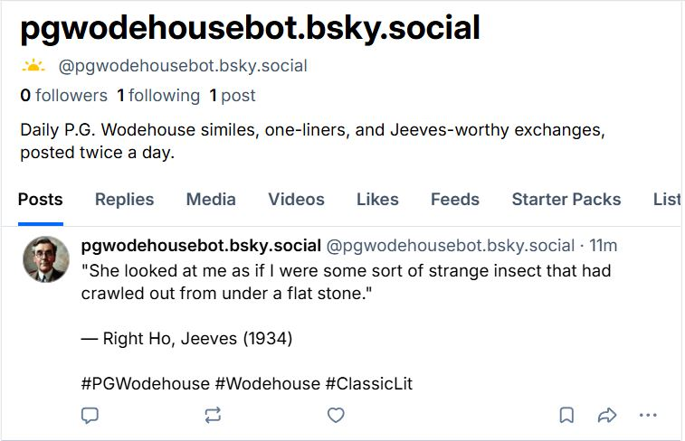

# Wodehouse Bot

A Bluesky bot that posts P.G. Wodehouse quotes daily — similes, dialogues, character spotlights, and more — on a rotating weekly schedule.

→ Follow on Bluesky: [@pgwodehousebot.bsky.social](https://bsky.app/profile/pgwodehousebot.bsky.social)



---

## What It Posts

Each day of the week has a different format:

| Day | Format | Example |
|-----|--------|---------|
| Monday | **Simile** | *"He looked like a sheep with a secret sorrow."* |
| Tuesday | **Setup + Quote** | Context line, then the killer one-liner |
| Wednesday | **Dialogue** | A two-post thread — the exchange, then the comeback |
| Thursday | **Character Spotlight** | Who said it, and why they said it |
| Friday | **Situation** | Scene-setting followed by the payoff |
| Saturday | **Simile** | Another classic comparison |
| Sunday | **Wildcard** | Anything goes |

Posts twice daily at **07:00 UTC** and **17:00 UTC** via GitHub Actions.

---

## Stack

- **Python 3.11**
- **[atproto](https://github.com/MarshalX/atproto)** — Bluesky AT Protocol SDK
- **GitHub Actions** — zero-server scheduler

---

## Running Locally

```bash
git clone https://github.com/your-username/wodehouse-bot
cd wodehouse-bot
pip install -r requirements.txt

# Dry run — prints the post without sending
BSKY_HANDLE=yourhandle.bsky.social \
BSKY_APP_PASSWORD=your-app-password \
python bot.py --dry-run

# Override today's format
python bot.py --dry-run --format simile
```

---

## GitHub Actions Setup

The bot runs entirely on GitHub Actions — no server needed.

**Secrets to add** (repo → Settings → Secrets → Actions):

| Secret | Value |
|--------|-------|
| `BSKY_HANDLE` | `pgwodehousebot.bsky.social` |
| `BSKY_APP_PASSWORD` | From Bluesky → Settings → App Passwords |

The workflow file is at `.github/workflows/post.yml`. It triggers on schedule and supports `workflow_dispatch` for manual test runs.

---

## Adding Quotes

All quotes live in `data/quotes.json`. Each entry follows this shape:

```json
{
  "id": 1,
  "format": "simile",
  "text": "He looked like a sheep with a secret sorrow.",
  "character": "Narrator",
  "book": "The Code of the Woosters",
  "year": 1938,
  "setup": null,
  "dialogue_response": null,
  "tags": ["simile", "appearance"]
}
```

For `dialogue` format, set `setup` to the scene description and `dialogue_response` to `{"character": "...", "text": "..."}` — it posts as a two-toot thread.

---

## Project

Part of the [Vibecoding](https://mrdee.in) series — building small, useful things with Claude Code.
