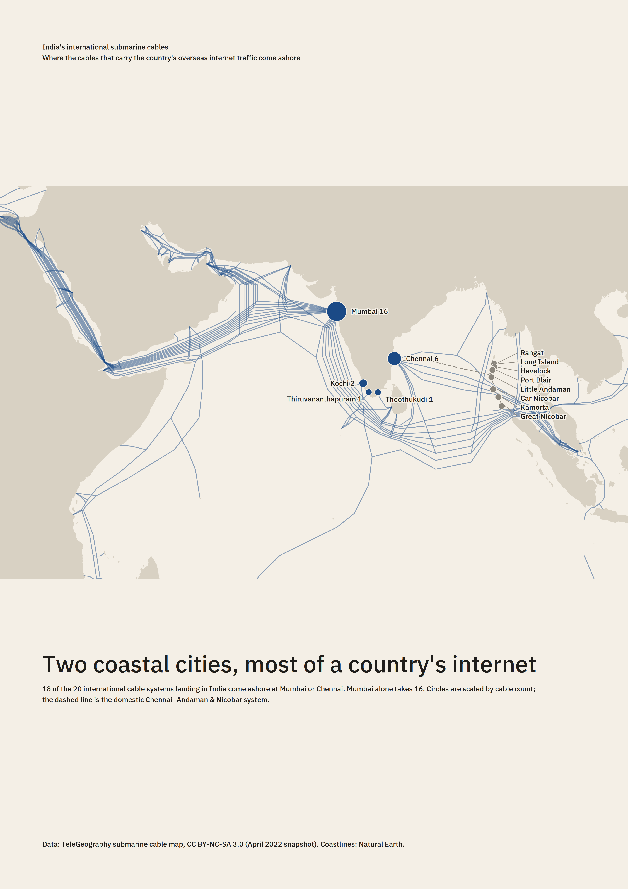

# India's international submarine cables — poster

A3 portrait (297 × 420 mm) print poster of where India's submarine cables come ashore,
built from TeleGeography's submarine cable map data and Natural Earth coastlines.



## Pipeline

| Step | Script | Output |
|---|---|---|
| Fetch data | `fetch_data.sh` (2022 GitHub snapshot) or `fetch_live.py` (current live API) | `data/telegeography/web/public/api/v3/...` |
| Analyse | `analyze.py` | `out/analysis.json` + summary table on stdout |
| Render | `render.py` | `out/poster.svg`, `out/poster.png` (3508 × 4961 px, 300 dpi) |

```
pip install shapely cairosvg pillow
python3 analyze.py      # prints the landing-point table, writes out/analysis.json
python3 render.py       # reads out/analysis.json; tweak the STYLE/LAYOUT block and rerun
```

`render.py` has no browser dependency: it writes the SVG by hand and rasterises with cairosvg.
IBM Plex Sans (OFL, in `fonts/`) is embedded in the SVG as `@font-face` so it prints the same everywhere;
install the two .ttf files locally if you want cairosvg to use it for the PNG.

## Data

- **Cables and landing points**: TeleGeography submarine cable map, API v3 JSON
  (`cable/cable-geo.json`, `landing-point/landing-point-geo.json`, per-slug `cable/*.json` and
  `landing-point/*.json`). Licence: **CC BY-NC-SA 3.0** (`data/telegeography/LICENSE`).
  TeleGeography removed its public GitHub repository in late 2022; the files here come from a
  faithful mirror and are the **2022-04-25** snapshot (`config.json`). `fetch_live.py` pulls the
  same layout from the live site if you have network access to it.
- **Coastlines**: Natural Earth 1:50m land, public domain (`data/natural_earth/`).

## Findings (2022 snapshot)

13 Indian landing points, 21 cable systems: 20 international and 1 domestic-only
(Chennai–Andaman & Nicobar Islands Cable, drawn dashed grey).

| Landing point | International cables | Domestic |
|---|---|---|
| Mumbai | 16 (6 planned as of 2022) | 0 |
| Chennai | 6 (2 planned) | 1 |
| Kochi | 2 | 0 |
| Thiruvananthapuram | 1 | 0 |
| Thoothukudi | 1 | 0 |
| 8 Andaman & Nicobar sites | 0 | 1 each |

Mumbai and Chennai together touch 18 of the 20 international systems; only SAFE (Kochi) and
Bharat Lanka (Thoothukudi) miss both.
